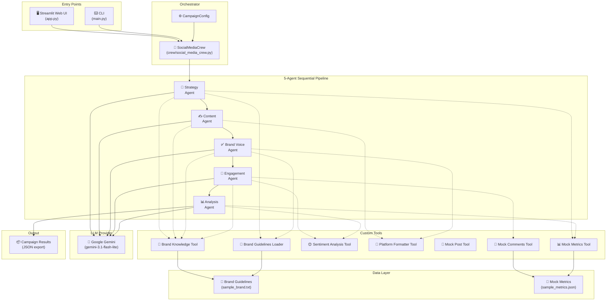
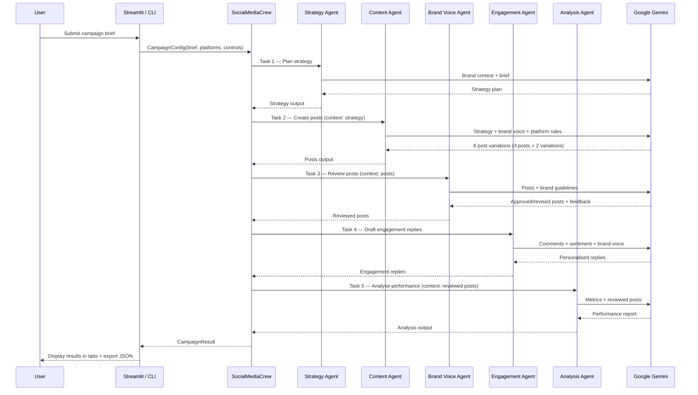
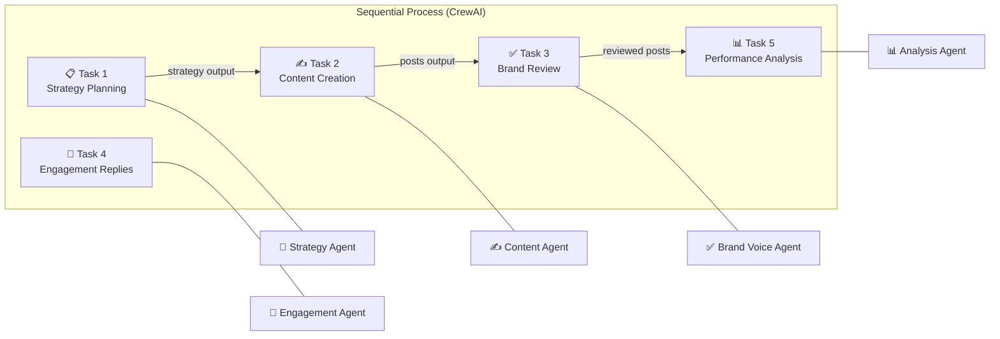

<p align="center">
  
  
  
  
  
</p>

<h1 align="center">🚀 Autonomous Social Media Brand Manager</h1>

<p align="center">
  <strong>A multi-agent AI system that autonomously plans, creates, reviews, engages, and analyses social media campaigns — powered by CrewAI and Google Gemini.</strong>
</p>

<p align="center">
  <em>Final Year Project — Multi-Agent AI System for Automated Social Media Management</em>
</p>

---

## 📌 Table of Contents

- [Overview](#-overview)
- [Key Features](#-key-features)
- [System Architecture](#-system-architecture)
- [Project Structure](#-project-structure)
- [Agent Pipeline](#-agent-pipeline)
- [Custom Tools](#-custom-tools)
- [Tech Stack](#-tech-stack)
- [Getting Started](#-getting-started)
- [Usage](#-usage)
- [Configuration](#%EF%B8%8F-configuration)
- [Customising for a Real Brand](#-customising-for-a-real-brand)
- [Evaluation (FYP)](#-evaluation-fyp)
- [Screenshots](#-screenshots)
- [Future Enhancements](#-future-enhancements)
- [Contributing](#-contributing)
- [License](#-license)

---

## 🧠 Overview

The **Autonomous Social Media Brand Manager** is a multi-agent AI system built on the [CrewAI](https://github.com/crewAIInc/crewAI) framework. It orchestrates **5 specialised AI agents** in a sequential pipeline that mirrors a real social media team:

1. **Strategy Director** — analyses brand guidelines and plans the campaign
2. **Copywriter** — generates platform-optimised posts with A/B variations
3. **Brand Voice Guardian** — enforces tone, compliance, and naturalness
4. **Engagement Manager** — responds to user comments with sentiment-aware replies
5. **Performance Analyst** — reviews metrics and produces actionable recommendations

Each agent is equipped with dedicated tools (brand knowledge retrieval, sentiment analysis, platform formatting, mock social APIs) and the entire pipeline is exposed through both a **Streamlit web dashboard** and a **CLI interface**.

---

## ✨ Key Features

| Feature | Description |
|---|---|
| **5-Agent Sequential Pipeline** | Strategy → Content → Review → Engagement → Analysis |
| **Brand-Grounded Generation** | Every agent loads brand guidelines via RAG-style tools before acting |
| **A/B Content Variations** | Content agent produces 2 variations per post (safe + creative) |
| **5-Point Brand Review** | Tone match, naturalness, guardrails, audience fit, hashtag compliance |
| **Sentiment-Aware Engagement** | VADER-based sentiment classification drives reply tone |
| **Platform Formatting** | Auto-validates character limits and hashtag counts per platform |
| **Configurable Controls** | Tone intensity, creativity level, and post length sliders |
| **Live Agent Pipeline UI** | Real-time animated progress tracker in Streamlit |
| **Cross-Platform Support** | Instagram, LinkedIn, X (Twitter), Facebook |
| **Memory-Enabled Crew** | Agents reference prior campaign data for continuity |
| **Dual Interface** | Streamlit web dashboard + command-line interface |
| **JSON Export** | Full campaign results exportable as structured JSON |

---

## 🏗 System Architecture



### Data Flow Diagram



---

## 📂 Project Structure

```
social_media_manager/
│
├── 📄 app.py                          # Streamlit web UI (Module 8)
├── 📄 main.py                         # CLI entry point (Module 7)
├── 📄 requirements.txt                # Python dependencies
├── 📄 .env.example                    # Environment variable template
├── 📄 .gitignore                      # Git ignore rules
├── 📄 run_agent.bat                   # Windows quick-launch script
│
├── ⚙️ config/                          # Module 1 — Configuration
│   ├── __init__.py
│   └── settings.py                    # Env loading, LLM config, platform limits
│
├── 🤖 agents/                         # Module 4 — AI Agents (5 specialists)
│   ├── __init__.py                    # Exports all agent factory functions
│   ├── strategy_agent.py             # 4a — Social Media Strategy Director
│   ├── content_agent.py              # 4b — Social Media Copywriter
│   ├── brand_voice_agent.py          # 4c — Brand Voice Guardian
│   ├── engagement_agent.py           # 4d — Community Engagement Manager
│   └── analysis_agent.py            # 4e — Social Media Performance Analyst
│
├── 📋 tasks/                          # Module 5 — Task Definitions
│   ├── __init__.py
│   └── task_definitions.py           # 5 task factories with configurable controls
│
├── 🔧 tools/                          # Module 3 — Custom CrewAI Tools
│   ├── __init__.py                    # Exports all tool classes
│   ├── brand_knowledge_tool.py       # 3a — Brand keyword search + full loader
│   ├── sentiment_tool.py             # 3b — VADER-based sentiment analyser
│   ├── mock_social_api.py            # 3c — Simulated post, comments, metrics APIs
│   └── platform_formatter.py        # 3d — Platform constraint validator
│
├── 🎯 crew/                           # Module 6 — Crew Orchestrator
│   ├── __init__.py
│   └── social_media_crew.py          # Builds crew, runs pipeline, returns results
│
├── 📁 data/                           # Module 2 — Data Assets
│   ├── brand_guidelines/
│   │   └── sample_brand.txt          # Sample brand doc (Eclipse Roasters)
│   └── mock_metrics/
│       └── sample_metrics.json       # Simulated 30-day engagement metrics
│
└── 📦 outputs/                        # Auto-generated — Campaign result JSONs
    └── campaign_YYYY-MM-DD.json
```

---

## 🤖 Agent Pipeline

The 5 agents execute **sequentially**, with each task's output feeding into the next:

| # | Agent | Role | Tools Used | Input | Output |
|---|---|---|---|---|---|
| 1 | **Strategy Director** | Plans campaign theme, content mix, cadence, KPIs | Brand Knowledge, Brand Guidelines Loader, Mock Metrics | Campaign brief + brand context | Strategy plan |
| 2 | **Copywriter** | Generates 3 posts × 2 variations per platform | Brand Knowledge, Platform Formatter | Strategy plan + brand voice | 6 post variations |
| 3 | **Brand Voice Guardian** | Reviews all posts against 5 quality checks | Brand Guidelines Loader, Brand Knowledge, Platform Formatter | Generated posts + brand rules | Approved/revised posts |
| 4 | **Engagement Manager** | Drafts sentiment-aware comment replies | Brand Knowledge, Sentiment Analysis, Mock Comments | Fetched comments | Personalised replies |
| 5 | **Performance Analyst** | Analyses metrics and produces recommendations | Mock Metrics, Sentiment Analysis | Reviewed posts + metrics | Performance report |

### Agent Interaction Model



---

## 🔧 Custom Tools

| Tool | Class | Purpose | Used By |
|---|---|---|---|
| **Brand Knowledge Search** | `BrandKnowledgeTool` | Keyword search over brand guidelines sections | Strategy, Content, Brand Voice, Engagement |
| **Brand Guidelines Loader** | `BrandGuidelinesLoaderTool` | Loads the complete brand guidelines document | Strategy, Brand Voice |
| **Sentiment Analysis** | `SentimentAnalysisTool` | VADER-based sentiment classification (positive/neutral/negative) | Engagement, Analysis |
| **Platform Formatter** | `PlatformFormatterTool` | Validates and trims content to platform character/hashtag limits | Content, Brand Voice |
| **Mock Post** | `MockPostTool` | Simulates publishing content (logs to `outputs/`) | — |
| **Mock Fetch Comments** | `MockFetchCommentsTool` | Returns sample comments from mock dataset | Engagement |
| **Mock Fetch Metrics** | `MockFetchMetricsTool` | Returns 30-day simulated engagement metrics | Strategy, Analysis |

### Platform Constraints

| Platform | Max Characters | Max Hashtags | Recommended Hashtags |
|---|---|---|---|
| Instagram | 2,200 | 30 | 11 |
| LinkedIn | 3,000 | 5 | 3 |
| X (Twitter) | 280 | 3 | 2 |
| Facebook | 63,206 | 10 | 5 |

---

## 🛠 Tech Stack

| Layer | Technology | Purpose |
|---|---|---|
| **Multi-Agent Framework** | [CrewAI](https://github.com/crewAIInc/crewAI) 0.80 | Agent orchestration, task chaining, memory |
| **LLM Provider** | Google Gemini (gemini-3.1-flash-lite) | Natural language generation |
| **Web UI** | [Streamlit](https://streamlit.io/) 1.39 | Interactive dashboard with live agent progress |
| **CLI** | [Rich](https://github.com/Textualize/rich) | Beautiful terminal output |
| **Sentiment Analysis** | [VADER](https://github.com/cjhutto/vaderSentiment) | Rule-based sentiment scoring (no API key needed) |
| **Embeddings** | Google Gemini Embeddings | CrewAI memory and context retrieval |
| **Data Validation** | [Pydantic](https://docs.pydantic.dev/) 2.9 | Configuration and data model validation |
| **Environment** | python-dotenv | Secure API key management |
| **Language** | Python 3.10+ | Core runtime |

---

## 🚀 Getting Started

### Prerequisites

- **Python 3.10+** installed
- A **Google API Key** with Gemini access ([Get one here](https://aistudio.google.com/apikey))

### Installation

```bash
# 1. Clone the repository
git clone https://github.com/your-username/social-media-brand-manager.git
cd social-media-brand-manager

# 2. Create a virtual environment
python -m venv venv

# Windows
venv\Scripts\activate

# macOS / Linux
source venv/bin/activate

# 3. Install dependencies
pip install -r requirements.txt

# 4. Configure your API key
cp .env.example .env
# Edit .env and set: GOOGLE_API_KEY=AIza...
```

---

## 📖 Usage

### Option A — Streamlit Web UI *(recommended)*

```bash
streamlit run app.py
```

Open [http://localhost:8501](http://localhost:8501) in your browser.

**Features of the Web UI:**
- 📝 Campaign brief input with quick-fill examples
- 📡 Multi-platform selector (Instagram, LinkedIn, X, Facebook)
- 🏷️ Inline brand guidelines editor
- 🎛️ Tone, creativity, and length sliders
- 🔄 Live animated agent pipeline with progress tracking
- 📡 Real-time agent logs panel
- 📊 Tabbed results view (Strategy → Posts → Reviews → Engagement → Analysis)
- 💾 JSON and TXT export/download

### Option B — Command Line

```bash
python main.py \
  --brief "Launch our new Eclipse Espresso blend for autumn" \
  --platforms Instagram LinkedIn
```

**CLI Arguments:**

| Argument | Required | Default | Description |
|---|---|---|---|
| `--brief` | ✅ | — | Campaign brief text |
| `--platforms` | ❌ | Instagram LinkedIn | Target platforms |

---

## ⚙️ Configuration

### Environment Variables

| Variable | Required | Default | Description |
|---|---|---|---|
| `GOOGLE_API_KEY` | ✅ | — | Google API key for Gemini |
| `LLM_MODEL` | ❌ | `gemini/gemini-3.1-flash-lite-preview` | LLM model identifier |
| `LLM_TEMPERATURE` | ❌ | `0.7` | Generation creativity (0.0–1.0) |
| `SERPER_API_KEY` | ❌ | — | For web search tool (optional) |

### Generation Controls (Web UI)

| Control | Options | Description |
|---|---|---|
| **Tone Intensity** | subtle · balanced · bold | Adjusts the energy level of generated content |
| **Creativity Level** | conservative · creative · experimental | Controls how unconventional the content style is |
| **Post Length** | short · medium · long | Target word count per post |

---

## 🔄 Customising for a Real Brand

1. **Brand Guidelines** — Replace `data/brand_guidelines/sample_brand.txt` with your own brand document. Include: brand name, tone, audience, voice, hashtags, and key differentiators.

2. **Metrics Data** — Replace `data/mock_metrics/sample_metrics.json` with real or updated engagement data.

3. **Real Posting APIs** — Swap `MockPostTool` with real API wrappers:
   - Instagram → [Graph API](https://developers.facebook.com/docs/instagram-api)
   - X (Twitter) → [Twitter API v2](https://developer.twitter.com/en/docs/twitter-api)
   - LinkedIn → [LinkedIn Marketing API](https://learn.microsoft.com/en-us/linkedin/marketing/)
   - Facebook → [Pages API](https://developers.facebook.com/docs/pages)

4. **Web Trend Search** — Add `SerperDevTool` from `crewai-tools` to the Strategy Agent and set `SERPER_API_KEY` in `.env`.

---

## 📊 Evaluation (FYP)

To demonstrate the multi-agent advantage:

1. Run the system for a fictional brand (the included `sample_brand.txt` for Eclipse Roasters is ready to use).
2. Run the same campaign brief through a single LLM prompt (no agents, no tools).
3. Have human evaluators rate both outputs on:
   - **Brand consistency** — Does the content match the brand voice?
   - **Engagement quality** — Are comment replies natural and helpful?
   - **Completeness** — Does the output cover strategy, content, review, engagement, and analysis?
4. Compare scores.

**Expected result:** The multi-agent system scores higher on consistency, engagement quality, and completeness due to specialised roles, tool usage, and the sequential review pipeline.

---

## 📸 Screenshots

> Run `streamlit run app.py` and use the dashboard to see:
> - **Campaign Brief Panel** with quick-fill examples
> - **Live Agent Pipeline** with animated progress cards
> - **Real-time Agent Logs** streaming in a terminal-style panel
> - **Tabbed Results** — Strategy, Posts, Reviewed Posts, Engagement, Analysis
> - **Export Panel** — Download full JSON report or posts-only TXT

---

## 🔮 Future Enhancements

### Short-Term Improvements

- [ ] **Automated Scheduling** — Add `APScheduler` for timed campaign execution
- [ ] **A/B Variant Selection** — Brand Voice Agent picks the best variation instead of approving both
- [ ] **Image Generation** — Integrate DALL·E or Imagen to auto-generate post visuals
- [ ] **Multi-Brand Support** — Load multiple brand guideline files and select at runtime
- [ ] **Unit & Integration Tests** — Add `pytest` test suite for tools, agents, and crew orchestration

### Medium-Term Enhancements

- [ ] **FAISS / ChromaDB Vector Store** — Replace keyword search with semantic vector retrieval for brand knowledge
- [ ] **Real Platform Integrations** — Swap mock tools with live Instagram, LinkedIn, X, and Facebook APIs
- [ ] **Webhook-Based Comment Monitoring** — Real-time comment ingestion instead of mock data
- [ ] **Campaign History Dashboard** — Historical comparison of campaign performance over time
- [ ] **Multi-Language Support** — Generate posts in different languages for global brands
- [ ] **User Authentication** — Add login/role-based access for team collaboration

### Long-Term Vision

- [ ] **Local LLM Support** — Run with Ollama (`LLM_MODEL=ollama/llama3`) for fully private, offline operation
- [ ] **Hierarchical Crew Process** — Allow agents to delegate sub-tasks to each other for complex campaigns
- [ ] **Competitor Analysis Agent** — 6th agent that monitors competitor social media activity
- [ ] **Content Calendar Integration** — Sync with Google Calendar, Notion, or Trello for publishing schedules
- [ ] **Analytics Dashboard** — Real-time performance tracking with charts and trend visualisation
- [ ] **Plugin Architecture** — Allow third-party tool/agent plugins for extensibility
- [ ] **Fine-Tuned Brand Models** — Train custom LoRA adapters on brand-specific content for perfect voice matching

---

## 🤝 Contributing

Contributions are welcome! Please follow these steps:

1. **Fork** the repository
2. **Create** a feature branch (`git checkout -b feature/amazing-feature`)
3. **Commit** your changes (`git commit -m 'Add amazing feature'`)
4. **Push** to the branch (`git push origin feature/amazing-feature`)
5. **Open** a Pull Request

Please make sure to:
- Follow the existing code style and module structure
- Add docstrings to new functions and classes
- Update this README if adding new agents, tools, or configuration options

---

## 📄 License

This project is licensed under the MIT License — see the [LICENSE](LICENSE) file for details.

---

<p align="center">
  <strong>Built with ❤️ using CrewAI + Google Gemini</strong><br/>
  <em>Autonomous Social Media Brand Manager — Multi-Agent AI System</em>
</p>
